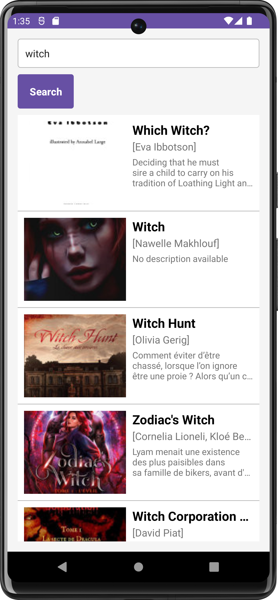
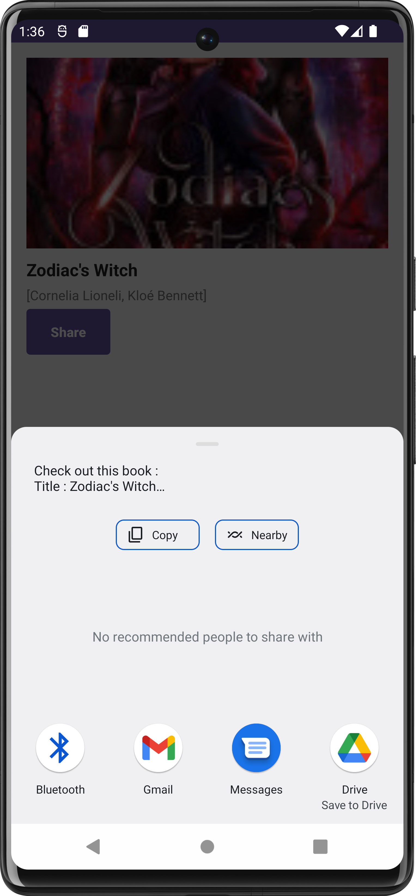

# 📚 Books Consulting App

Books Consulting App is a mobile application that allows users to search for books using the Google Books API and view details about the books, including title, authors, and description.

## ✨ Features

- 🔍 **Search for Books**: Enter keywords in the search bar to find books.
- 📋 **View Book List**: See a list of books matching your search criteria.
- 📖 **Book Details**: View detailed information about each book, including title, authors, and description.
- 📤 **Share Books**: Share book details with friends.

## 🛠 Technologies Used

- 📝 **Java**
- 🌐 **Retrofit** (for API calls)
- 🗃 **Gson** (for JSON serialization/deserialization)
- 🖼 **Picasso** (for image loading)

## 🚀 Installation

1. **Clone the repository:**
   ```bash
   git clone https://github.com/elmouaddibe/books-consulting-app.git
   ```
2. **Open the project in Android Studio.**
3. **Build and run the project** on an Android emulator or device.

## 📱 Usage

1. **Enter keywords** related to the book you're looking for in the search bar.
2. **Tap the search button** to fetch books matching the search criteria.
3. **Scroll through the list** of books to find the one you're interested in.
4. **Tap on a book** to view detailed information about it.

## 📷 Screenshots

### 🔍 Search for Books


### 📖 View Book Details and Share


## 🤝 Contributing

Feel free to contribute to this project by creating pull requests!
> This project is intended for demonstration purposes only.
